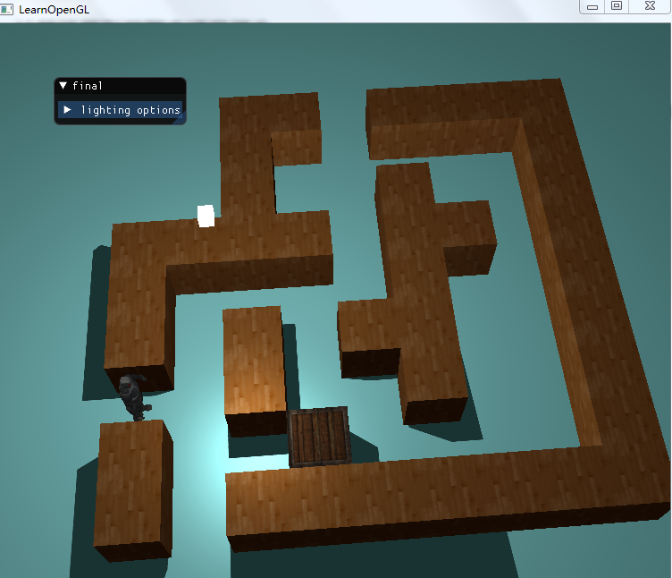
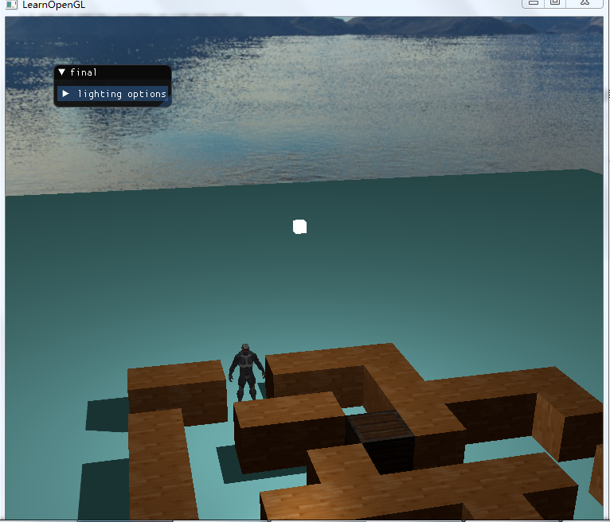
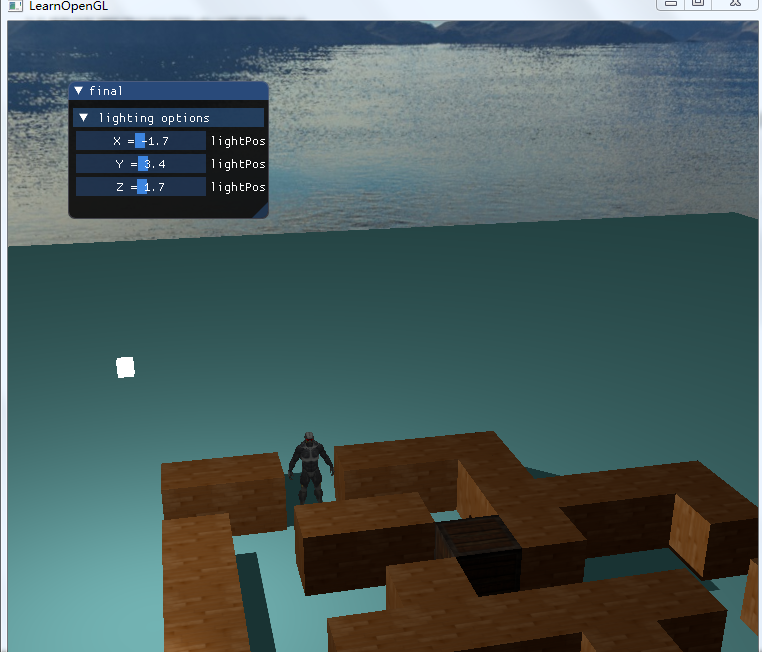
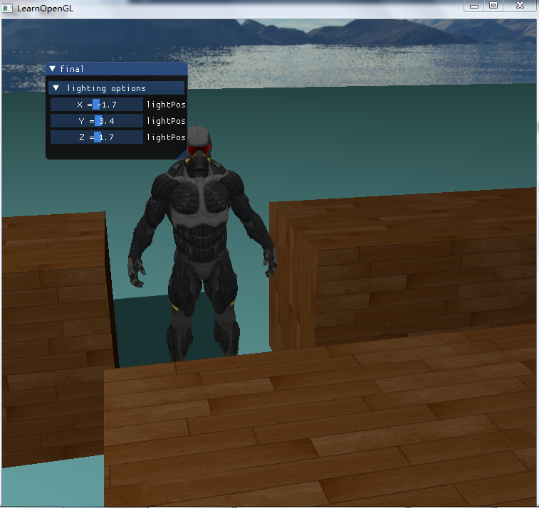
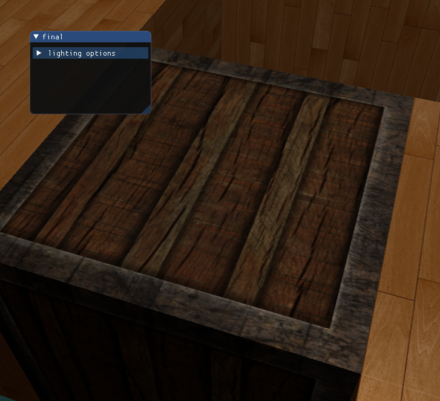
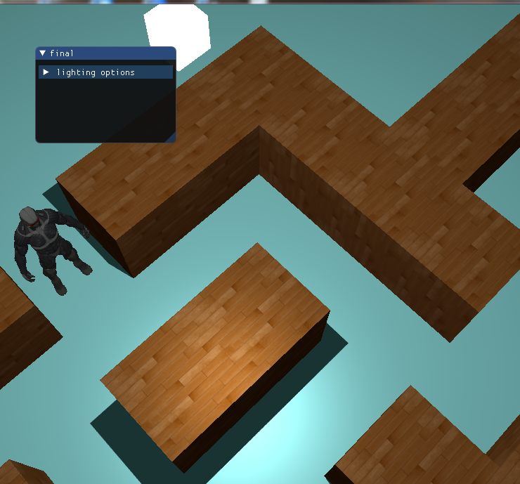
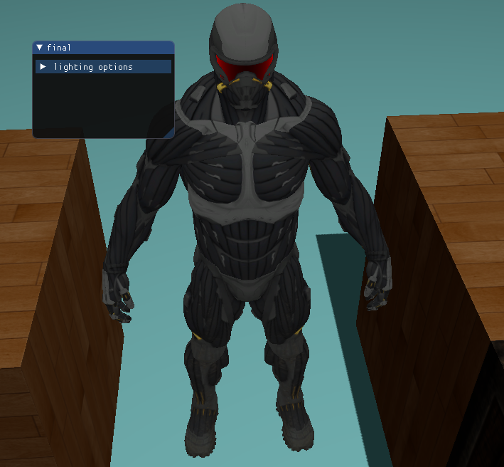

### 计算机图形学期末项目报告

#### 项目介绍及实现结果

本项目实现的是一个模仿吃豆人的走迷宫的小游戏，现阶段只实现了迷宫的构建和可操作对象的移动和视角的移动。后期会添加得分物体以实现分数获取功能。

实现结果部分截图如下：






#### 开发环境及使用到的第三方库

开发环境：VS2017

第三方库：模型载入库：assimp，贴图载入库：stb_image.h，文字导入库：freetype

#### 实现功能列表

**基本功能**：

1. 相机移动
2. 光照
3. 阴影实现
4. 物体贴图
5. 模型载入

**额外功能**：

1. 天空盒
2. 物体碰撞检测
3. 文本渲染

#### 实现功能的简单介绍

**相机移动**：

1. camera中包含了摄像机的各种成员变量，可以通过成员函数改变相应的成员变量，当调用getViewMatrix时就返回一个最新的摄像机的view矩阵。

2. 通过回调函数监听键盘输入事件，每次监听到就改变摄像机的位置

3. 通过一个全局变量deltaTime平衡上下帧之间的时间，进而平衡摄像机的移动速度

4. 处理鼠标输入的时候，有以下步骤：

   - 计算鼠标距上一帧的偏移量。
   - 把偏移量添加到摄像机的俯仰角和偏航角中。
   - 对偏航角和俯仰角进行最大和最小值的限制。
   - 计算方向向量。

5. 处理视野缩放函数

   ```C++
   void Camera::processMouseScroll(float yoffset) {
       if (Zoom >= 1.0f && Zoom <= 45.0f)
           Zoom -= yoffset;
       if (Zoom <= 1.0f)
           Zoom = 1.0f;
       if (Zoom >= 45.0f)
           Zoom = 45.0f;
   }
   ```

**纹理贴图**

1. 首先调用stb_image.h库中的函数加载纹理图片。

2. 然后是生成纹理，这里我们使用一个函数将整个纹理生成的过程封装起来

   ```C++
   unsigned int loadTexture(const char* path) {
       unsigned int textureID;
       glGenTextures(1, &textureID);
   
       int width, height, nrComponents;
       unsigned char *data = stbi_load(path, &width, &height, &nrComponents, 0);
       if (data)
       {
           GLenum format;
           if (nrComponents == 1)
               format = GL_RED;
           else if (nrComponents == 3)
               format = GL_RGB;
           else if (nrComponents == 4)
               format = GL_RGBA;
   
           glBindTexture(GL_TEXTURE_2D, textureID);
           glTexImage2D(GL_TEXTURE_2D, 0, format, width, height, 0, format, GL_UNSIGNED_BYTE, data);
           glGenerateMipmap(GL_TEXTURE_2D);
   
           glTexParameteri(GL_TEXTURE_2D, GL_TEXTURE_WRAP_S, GL_REPEAT);
           glTexParameteri(GL_TEXTURE_2D, GL_TEXTURE_WRAP_T, GL_REPEAT);
           glTexParameteri(GL_TEXTURE_2D, GL_TEXTURE_MIN_FILTER, GL_LINEAR_MIPMAP_LINEAR);
           glTexParameteri(GL_TEXTURE_2D, GL_TEXTURE_MAG_FILTER, GL_LINEAR);
   
           stbi_image_free(data);
       }
       else
       {
           std::cout << "Texture failed to load at path: " << path << std::endl;
           stbi_image_free(data);
       }
   
       return textureID;
   }
   ```

3. 应用纹理的时候需要在顶点数组中添加纹理坐标，然后在顶点着色器中调整顶点着色器使其能够接受顶点坐标为一个顶点属性，并把坐标传给片段着色器。

4. 然后因为我们的纹理贴图结合了光照，因此在片段着色器中，通过纹理坐标，从纹理中采样片段的漫反射，镜面反射的颜色值，将得到的光贴图FragColor渲染到物体上。

5. 在调用glDrawElements之前绑定纹理了，它会自动把纹理赋值给片段着色器的采样器：

   ```C++
   glActiveTexture(GL_TEXTURE0);
   glBindTexture(GL_TEXTURE_2D, containerMap);
   ```

纹理贴图的效果：



**光照**

采用的是冯氏光照模型，由于地面是没有纹理的，而物体和迷宫的墙壁是有纹理的，因此我设置了一个参数可以选择纹理或者颜色。这样就可以实现光照贴图是时候既能展示没有纹理的地板，也可以展示有纹理的物体。

```C++
vec3 color = texture(diffuseTexture, fs_in.TexCoords).rgb;
vec3 objColor = (typeColor) ? objectColor : color;
```

**阴影部分**

使用之前作业实现阴影的方法，直接就拿过来用了，简单来说，实现阴影有两个步骤：

1. 首先，需要渲染深度贴图
2. 使用生成的深度贴图计算片元是否在阴影中，以摄像机方向。

光照和阴影的效果：



**模型的载入**

使用的是Assimp库，当使用Assimp导入一个模型的时候，它通常会将整个模型加载进一个**场景**(Scene)对象，它会包含导入的模型/场景中的所有数据。Assimp会将场景载入为一系列的节点(Node)，每个节点包含了场景对象中所储存数据的索引，每个节点都可以有任意数量的子节点。

因此，使用Assimp导入模型需要做的第一件事是将一个物体加载到Scene对象中，遍历节点，获取对应的Mesh对象（我们需要递归搜索每个节点的子节点），并处理每个Mesh对象来获取顶点数据、索引以及它的材质属性。最终的结果是一系列的网格数据，我们会将它们包含在一个Model对象中。

其中一个Mesh类需要的变量包括：一系列顶点，用于索引绘制的索引以及纹理形式的材质数据。然后是初始化，包括配置正确的缓冲，并通过顶点属性指针定义顶点着色器的布局。接着是定义Mesh函数进行渲染。

对于Model类，包括初始化的时候调用loadModel函数，这个函数会使用Assimp来加载模型至Assimp的一个叫做scene的数据结构中，然后是处理场景中所有节点，处理完之后遍历所有网格调用Draw函数，生成模型。

效果：



**天空盒**

天空盒是一个包含了整个场景的（大）立方体，它包含周围环境的6个图像，让玩家以为他处在一个比实际大得多的环境当中。这里使用的贴图是OpenGL教程中的贴图。加载天空盒和加载一个立方体的贴图是类似的，不过这个贴图的六个面用不同的纹理贴图，因此我们会定义一个vector并把这六张图的地址传入进去，然后用一个函数来加载。

```cpp
unsigned int loadCubemap(vector<std::string> faces)
{
    unsigned int textureID;
    glGenTextures(1, &textureID);
    glBindTexture(GL_TEXTURE_CUBE_MAP, textureID);

    int width, height, nrChannels;
    for (unsigned int i = 0; i < faces.size(); i++)
    {
        unsigned char *data = stbi_load(faces[i].c_str(), &width, &height, &nrChannels, 0);
        if (data)
        {
            glTexImage2D(GL_TEXTURE_CUBE_MAP_POSITIVE_X + i, 0, GL_RGB, width, height, 0, GL_RGB, GL_UNSIGNED_BYTE, data);
            stbi_image_free(data);
        }
        else
        {
            std::cout << "Cubemap texture failed to load at path: " << faces[i] << std::endl;
            stbi_image_free(data);
        }
    }
    glTexParameteri(GL_TEXTURE_CUBE_MAP, GL_TEXTURE_MIN_FILTER, GL_LINEAR);
    glTexParameteri(GL_TEXTURE_CUBE_MAP, GL_TEXTURE_MAG_FILTER, GL_LINEAR);
    glTexParameteri(GL_TEXTURE_CUBE_MAP, GL_TEXTURE_WRAP_S, GL_CLAMP_TO_EDGE);
    glTexParameteri(GL_TEXTURE_CUBE_MAP, GL_TEXTURE_WRAP_T, GL_CLAMP_TO_EDGE);
    glTexParameteri(GL_TEXTURE_CUBE_MAP, GL_TEXTURE_WRAP_R, GL_CLAMP_TO_EDGE);

    return textureID;
}
```

vector的设置：

```cpp
vector<std::string> faces
{
    "./resources/skybox/right.jpg",
    "./resources/skybox/left.jpg",
    "./resources/skybox/top.jpg",
    "./resources/skybox/bottom.jpg",
    "./resources/skybox/front.jpg",
    "./resources/skybox/back.jpg"
};
unsigned int cubemapTexture = loadCubemap(faces);
```

在加载天空盒的时候还需要注意一些问题，比如说天空盒是一个背景，在我们显示的物体中为最外层或者说最底层，因此我们要把它作为作为第一个渲染的物体并且禁用深度写入，这样子就会永远在其他物体背后。还有就是在我们移动物体的时候，需要营造场景非常大的现象，那么在以玩家的视角里，天空的相对位置应该不变，所以我们要保持天空盒贴图不移动，在这里我们需要将天空盒的观察矩阵由4×4取其左上角的3×3矩阵，移除掉变换的部分。也就是将观察矩阵先转为3×3矩阵，再转回4×4矩阵。

```cpp
view = glm::mat4(glm::mat3(camera.getViewMatrix())); 
```


**物体碰撞检测**

这里使用的是最简单的碰撞检测，通过存储每一个组成墙壁的正方体的坐标，然后物体的大小设计成和正方体的大小一致，物体每次移动一个正方体的长度，也就是说，物体每一次移动一格，然后通过map判断这一格是否存在墙壁正方体，如果存在，将物体的位置回退一格。

```C++
rightTo -= 15.0f*deltaTime;
glm::vec3 position = glm::vec3(roundf(forwardTo), 0.0f, roundf(rightTo));
if (!canMove(position)) {
    rightTo += 15.0f*deltaTime;
}
//canMove
std::map<int, glm::vec3>::iterator iter;
for (iter = wall.begin(); iter != wall.end(); iter++) {
    if (iter->second == nextPosition) return false;
}
return true;
```

**文本渲染**  

这里是使用了freetype的库去渲染英文的一个字母的。FreeType所做的事就是加载TrueType字体并为每一个字形生成位图以及计算几个度量值(Metric)。我们可以提取出它生成的位图作为字形的纹理，并使用这些度量值定位字符的字形。  

首先需要加载一种字体。由于在一个项目中可能没有权限去访问到```Windows/Fonts```，所以这里我是将```arial.ttf```这个字体放到了文件资源库中，代码如下：  
```C++
FT_Library ft;
if(FT_Init_FreeType(&ft))
    std::cout << "ERROR::FREETYPE: Could not init FreeType Library" << std::endl;

// Load font as face
FT_Face face;
if (FT_New_Face(ft, ".\\resources\\arial.ttf", 0, &face))
    std::cout << "ERROR::FREETYPE: Failed to load font" << std::endl;
```  

加载字体之后，需要定义字体的大小，然后也需要从字体中获取ASCII字符集中的英文字母。所以我们需要先定义一个结构体Character去存储字符以及渲染一个字符需要的全部数据。结构体和获取字符的代码如下：  
```C++
struct Character {
    GLuint TextureID;
    glm::ivec2 Size;
    glm::ivec2 Bearing;
    GLuint Advance;
};

std::map<GLchar, Character> Characters;

// Load first 128 characters of ASCII set
for (GLubyte c = 0; c < 128; c++)
{
    // Load character glyph 
    if (FT_Load_Char(face, c, FT_LOAD_RENDER))
    {
        std::cout << "ERROR::FREETYTPE: Failed to load Glyph" << std::endl;
        continue;
    }
    // Generate texture
    GLuint texture;
    glGenTextures(1, &texture);
    glBindTexture(GL_TEXTURE_2D, texture);
    glTexImage2D(
        GL_TEXTURE_2D,
        0,
        GL_RED,
        face->glyph->bitmap.width,
        face->glyph->bitmap.rows,
        0,
        GL_RED,
        GL_UNSIGNED_BYTE,
        face->glyph->bitmap.buffer
    );
    // Set texture options
    glTexParameteri(GL_TEXTURE_2D, GL_TEXTURE_WRAP_S, GL_CLAMP_TO_EDGE);
    glTexParameteri(GL_TEXTURE_2D, GL_TEXTURE_WRAP_T, GL_CLAMP_TO_EDGE);
    glTexParameteri(GL_TEXTURE_2D, GL_TEXTURE_MIN_FILTER, GL_LINEAR);
    glTexParameteri(GL_TEXTURE_2D, GL_TEXTURE_MAG_FILTER, GL_LINEAR);
    // Now store character for later use
    Character character = {
        texture,
        glm::ivec2(face->glyph->bitmap.width, face->glyph->bitmap.rows),
        glm::ivec2(face->glyph->bitmap_left, face->glyph->bitmap_top),
        face->glyph->advance.x
    };
    Characters.insert(std::pair<GLchar, Character>(c, character));
}
```
字体着色器部分大致和之前的没有区别，于是此处报告就不单独提出着色器代码部分。主要思想是：顶点着色器需要获取当前的投影矩阵坐标，计算文本渲染的位置；片段着色器需要有两个uniform变量，一个是单颜色通道的字形位图纹理，另一个是颜色uniform，调整最终颜色。这两个需要从主代码中传递值进去。  

渲染字体需要启用混合才能成功：
```C++
glEnable(GL_CULL_FACE);
glEnable(GL_BLEND);
glBlendFunc(GL_SRC_ALPHA, GL_ONE_MINUS_SRC_ALPHA);
```  

最后需要用```textVBO```和```textVAO```去渲染四边形，所以我们需要预先分配内存，在渲染的时候，每个2D四边形需要6个顶点，每个顶点是由4float向量组成。所以我的内存分配如下：  
```C++
//text VAO
glGenVertexArrays(1, &textVAO);
glGenBuffers(1, &textVBO);
glBindVertexArray(textVAO);
glBindBuffer(GL_ARRAY_BUFFER, textVBO);
glBufferData(GL_ARRAY_BUFFER, sizeof(GLfloat) * 6 * 4, NULL, GL_DYNAMIC_DRAW);
glEnableVertexAttribArray(0);
glVertexAttribPointer(0, 4, GL_FLOAT, GL_FALSE, 4 * sizeof(GLfloat), 0);
glBindBuffer(GL_ARRAY_BUFFER, 0);
glBindVertexArray(0);
```

最后的渲染过程我使用了一个函数。渲染的实现，需要首先计算出四边形的原点坐标和字体的大小，这样生成6个顶点形成这个2D四边形，可以通过```scale```进行缩放，然后更新VBO的内容，渲染四边形。代码如下：  

```C++
void RenderText(Shader &shader, std::string text, GLfloat x, GLfloat y, GLfloat scale, glm::vec3 color)
{
    // Activate corresponding render state	
    shader.use();
    glUniform3f(glGetUniformLocation(shader.ID, "textColor"), color.x, color.y, color.z);
    glActiveTexture(GL_TEXTURE0);
    glBindVertexArray(textVAO);

    // Iterate through all characters
    std::string::const_iterator c;
    for (c = text.begin(); c != text.end(); c++)
    {
        Character ch = Characters[*c];

        GLfloat xpos = x + ch.Bearing.x * scale;
        GLfloat ypos = y - (ch.Size.y - ch.Bearing.y) * scale;

        GLfloat w = ch.Size.x * scale;
        GLfloat h = ch.Size.y * scale;
        // Update VBO for each character
        GLfloat textvertices[6][4] = {
            { xpos,     ypos + h,   0.0, 0.0 },
            { xpos,     ypos,       0.0, 1.0 },
            { xpos + w, ypos,       1.0, 1.0 },

            { xpos,     ypos + h,   0.0, 0.0 },
            { xpos + w, ypos,       1.0, 1.0 },
            { xpos + w, ypos + h,   1.0, 0.0 }
        };
        // Render glyph texture over quad
        glBindTexture(GL_TEXTURE_2D, ch.TextureID);
        // Update content of VBO memory
        glBindBuffer(GL_ARRAY_BUFFER, textVBO);
        glBufferSubData(GL_ARRAY_BUFFER, 0, sizeof(textvertices), textvertices); // Be sure to use glBufferSubData and not glBufferData

        glBindBuffer(GL_ARRAY_BUFFER, 0);
        glDrawArrays(GL_TRIANGLES, 0, 6);
        x += (ch.Advance >> 6) * scale; 
    }
    glBindVertexArray(0);
    glBindTexture(GL_TEXTURE_2D, 0);
}
```

#### 遇到的问题和解决方法

我在实现碰撞检测的时候一开始使用的是测量碰撞物体和墙壁之间的距离，当距离小于一定的值后判断为碰撞，但是比较难实现，因为需要判断是哪一面发生了碰撞，比较繁琐，因此我选择让物体每次移动一个单元，然后判断这个单元是否为墙壁，移动一个单元的实现方法是通过deltaTime控制移动距离，然后通过round函数保证移动的距离为整数，这个15.0f保证了每一移动的距离是一个大于0.5小于1的值：

```C++
rightTo -= 15.0f*deltaTime;
glm::vec3 position = glm::vec3(roundf(forwardTo), 0.0f, roundf(rightTo));
if (!canMove(position)) {
    rightTo += 15.0f*deltaTime;
}
```

#### 小组成员分工

王亮岛：负责光照和阴影的实现，摄像机移动的实现，以及纹理贴图的实现，拓展功能实现了碰撞检测。  
王思诚：实现天空盒。  
廖蕾：实现文本渲染
